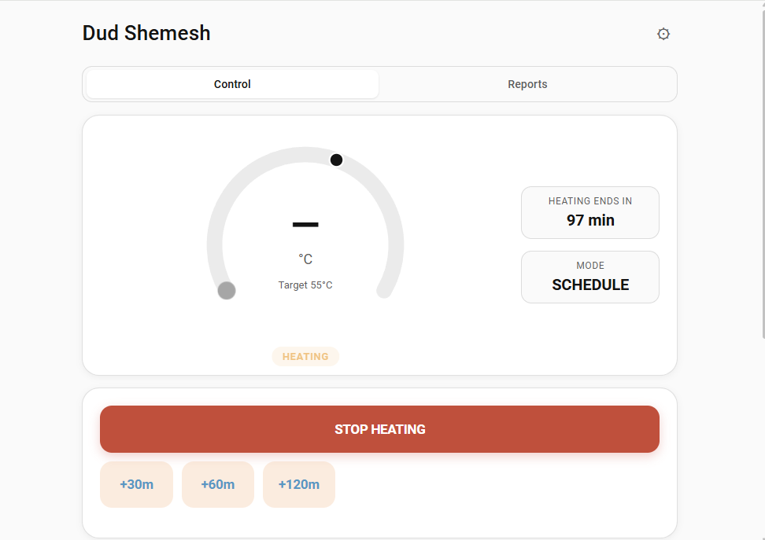
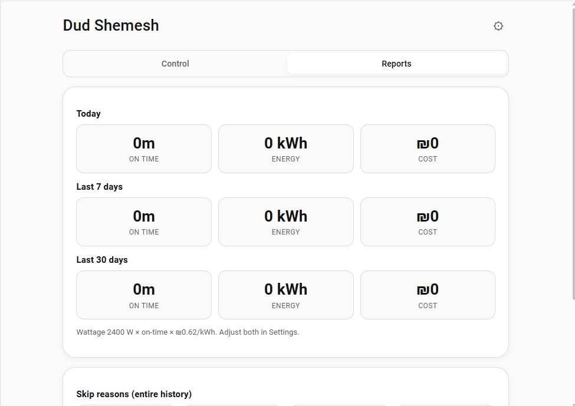
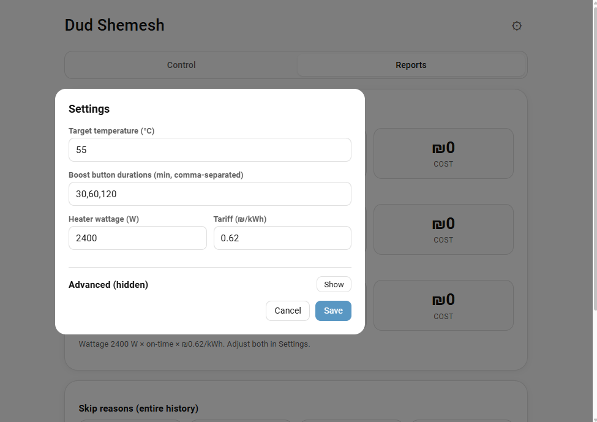
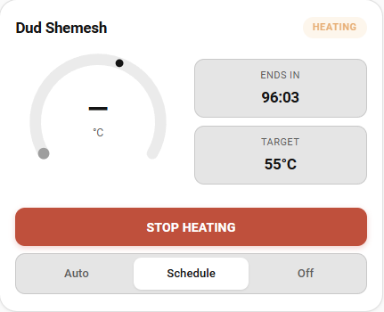

# Dud Shemesh — Smart solar water heater controller for Home Assistant

A Home Assistant **custom integration** that turns any smart switch + temperature sensor into an intelligent **dud shemesh** (Israeli solar water heater) controller. Same UX as commercial smart-dud appliances, polished and built for the way Israeli families actually use their water heater.

> Why: commercial smart-dud devices cost ₪400–800 and trap you in proprietary apps. This integration lives entirely in Home Assistant, runs on whatever relay + temp sensor you already have, and saves real electricity by skipping heat cycles when the tank is already warm enough.

## Screenshots

### Panel — Control

Big circular gauge with drag-to-set target marker, status badge, side pills (ends-in / target / anti-Legionella), boost row, mode toggle, today timeline, schedule list.

### Panel — Reports

Today / 7-day / 30-day on-time, kWh, ₪ cost (configurable IEC tariff). Heater health (avg °C/min). 24h tank-temperature graph. Skip-reasons summary.

### Settings (advanced expanded)

Calendar one-off heat, weather skip, solar tracking, fail detection, anti-Legionella, vacation mode, notifications.

### Lovelace card

Compact gauge + boost + mode for embedding on any dashboard view.

## Features

**Hero UI**
- Big circular SVG gauge with **drag-to-set** target marker, live color (cool→hot), pulsing ring while heating.
- Live **status badge**: Ready / Heating / Waiting / Solar / Cold, with the run source while heating ("Heating · Boost").
- **Next heat** answer: "Hot by 06:30" / "Morning shower · tomorrow 06:15, in 17h 20m".
- **Showers available** estimate (set the tank volume in Settings).
- Target −/+ buttons next to the drag marker.
- Side pills for "Ends in", "To target", showers, mode and **Anti-Legionella next-due**.

**Control**
- One-tap **boost** buttons; durations are configurable (default `30,60,120` min).
- Boost while heating **extends** the active run instead of restarting it.
- **Mode toggle**: Auto / Schedule / Off.
- Recurring **schedules** (HH:MM + days + duration, optional target temperature), on/off switch, next-run line and **skip next** (holiday / away one day).
- Today timeline shows past runs **and planned** heating.
- Companion Lovelace **`custom:dud-shemesh-card`**: gauge, −/+ target, next heat, boost / extend / stop, mode. Visual editor with tank picker (`entry_id`), `title`, `show_mode`.

**Smart layer**
- **Real Auto mode**: predictive pre-heat for configured comfort windows (`06:30-08:00,19:00-21:00`), timed with the tank's **learned heating speed** (°C/min from finished runs; physics fallback from tank volume and wattage).
- **Time-of-use prices**: set price windows (e.g. `23:00-07:00@0.49`); auto pre-heat moves to the cheapest hours that still finish in time, and every run records its real cost.
- **Shabbat mode**: with the Jewish Calendar integration, heats before candle lighting, optionally locks the controls and silences notifications until havdalah.
- **Skip-if-warm**: schedule run is skipped when tank already at target.
- **Solar gain detection**: rolling 30-min temperature delta; auto-skips electric when sun is contributing.
- **Weather-aware skip**: optional weather entity; `sunny` → skip schedule. With **forecast hours** set, uses the hourly forecast (condition / cloud cover) instead of the current state. Or point it at a solar production forecast sensor (Forecast.Solar, Solcast). Never applied between sunset and sunrise (uses `sun.sun`).
- **Soil-of-water-heaters style**: anti-Legionella weekly cycle to a configurable temp.

**Reliability**
- **Heat-not-rising detection**: verifies tank actually warms up after element turns on; alerts on element/breaker fault.
- **"Forgot the dud on" guard**: a heater switched on outside Dud Shemesh is adopted as a run and turned off after 60 min (configurable, 0 = off).
- **Hard limits**: maximum run length (default 180 min, caps boosts too) and over-temperature cutoff (default 75 °C).
- **Stale sensor detection**: a temperature sensor that stops reporting (default 120 min) is ignored; runs fall back to time-only and you get a `sensor_stale` notification.

**Visibility**
- **Reports tab**: "Saved this month ₪X" from runs the sun made unnecessary, 30-day electric vs avoided kWh chart, today / 7-day / 30-day on-time, energy (kWh) and cost (₪). Heater health avg °C/min trend. Run outcomes.
- **Native entities** on one device per water heater:
  - `water_heater` (target temperature, mode, away = vacation, on = heat now);
  - buttons for each boost duration, stop, anti-Legionella now;
  - `select` for mode; switches for heat now, vacation, anti-Legionella;
  - binary sensors for heating, solar gaining, temperature sensor problem;
  - sensors: status (with `next_heat_*`, `hot_by`, `showers_available`, `heat_rate_*` attributes), tank temperature, minutes-to-target, and **energy (kWh, `total_increasing`) for the HA Energy dashboard**.
- Reports: 24 h / 7 day tank temperature chart from HA history with heating runs shaded.

**Triggers & convenience**
- **Vacation mode**: pick an "active until" date; schedules suspended, tank held at anti-mold temp (default 30 °C).
- **Calendar-driven one-off heat**: events on a chosen calendar with summary containing a keyword (`dud,water,חם,מים,דוד` default) fire heat runs. Description sets minutes / target temp.
- **Voice via Assist**: `DudShemeshBoost`, `DudShemeshStop` and `DudShemeshStatus` intents with ready-made English and Hebrew sentences (see [Voice](#voice-assist)). The `water_heater` entity also works with the built-in turn on / off intents.
- **Notifications**: pick `notify.*` services + which events push (heat start/end, target reached, fault, skips, anti-Legionella, safety stop, sensor offline, manual turn-on, cold warning). Companion-app (`mobile_app_*`) notifications get **action buttons** (Heat now / Boost 1 h / Keep 30 min / Turn off). Texts follow the HA language (English / Hebrew).
- **Cold warning**: 60 min before a comfort window, if the tank is cold and nothing is planned, you get "won't be hot by 07:00" with a Boost button.

**Multi-instance**
- Add the integration multiple times for vacation homes or two heaters. Each runs its own scheduler and has its own storage file (`.storage/dud_shemesh.data.<entry_id>`). All services take an optional `entry_id`; without it they act on the first entry. The panel has a tank picker; the Lovelace card can target any entry.

**i18n**
- Full English + Hebrew UI (panel and card), **right-to-left** layout when HA language is `he`, Sunday-first week.

**Platform**
- Config flow asks for the heater, sensor, target, wattage, tank volume, price and comfort windows (validated); everything else lives in the panel Settings (tabbed). Settings are admin-only; everyday controls (mode, target, heat now, vacation) work for every user.
- Domain-aware: `switch`, `input_boolean` for the heater relay.
- Persistent storage via HA's `Store` helper.

## Install

### Via HACS

1. HACS → ⋮ → Custom repositories → add `https://github.com/bareli/dud_shemesh` as **Integration**.
2. Search **Dud Shemesh** → Download → restart Home Assistant.
3. Settings → Devices & Services → + Add Integration → **Dud Shemesh**.
4. Pick the heater relay (a `switch.*` controlling the electric immersion element) and the tank temperature sensor (a numeric `sensor.*` in °C).

### Manual

1. Copy `custom_components/dud_shemesh/` into `<config>/custom_components/`.
2. Restart HA.
3. Add the integration from the UI.

Minimum HA version: **2024.7.0**.

## Required entities

| Entity | Required | Notes |
| ------ | -------- | ----- |
| Heater relay (`switch.*`) | yes | The electric immersion element. |
| Tank temperature sensor (`sensor.*` in °C) | optional | A DS18B20 on the tank, or any thermistor exposed as a numeric sensor. Without it the integration runs in dumb-schedule mode. |

## Services

| Service | Purpose |
| ------- | ------- |
| `dud_shemesh.boost` | Start the heater for N minutes (`minutes` parameter). |
| `dud_shemesh.cancel_boost` | Stop the heater immediately. |
| `dud_shemesh.set_mode` | `auto` / `schedule` / `off`. |
| `dud_shemesh.set_target_temp` | Change the target temperature. |
| `dud_shemesh.add_schedule` | Add a recurring schedule (returns the new id). |
| `dud_shemesh.update_schedule` | Patch an existing schedule by id. |
| `dud_shemesh.remove_schedule` | Delete a schedule by id. |
| `dud_shemesh.legionella_run_now` | Force a 60 °C+ heating cycle. |
| `dud_shemesh.list_config` | Returns schedules, history, active run, options, current status (response service). |

Every service accepts an optional `entry_id` to target a specific water heater when the integration is added more than once.

## Voice (Assist)

Copy the sentence file for your language into Home Assistant and restart:

| Language | File | Copy to |
| -------- | ---- | ------- |
| English | [`docs/assist/en/dud_shemesh.yaml`](docs/assist/en/dud_shemesh.yaml) | `<config>/custom_sentences/en/dud_shemesh.yaml` |
| Hebrew | [`docs/assist/he/dud_shemesh.yaml`](docs/assist/he/dud_shemesh.yaml) | `<config>/custom_sentences/he/dud_shemesh.yaml` |

Examples: "boost the water heater for 45 minutes", "is there hot water", "stop the water heater"; "תדליק את הדוד לחצי שעה", "יש מים חמים", "תכבה את הדוד".

## Events

| Event | When | Data |
| ----- | ---- | ---- |
| `dud_shemesh_heat_started` | Heater is turned on | `source`, `duration_min`, `target_temp`, `starting_temp` |
| `dud_shemesh_heat_finished` | Heater turned off | `source`, `status` (`completed` / `target_reached` / `cancelled` / `manual_stop` / `external_stop` / `superseded` / `voice` / `expired_during_downtime`), `duration_min` (planned), `actual_min` (element on-time), `starting_temp`, `ending_temp` |
| `dud_shemesh_target_reached` | Tank hit configured target during a heat cycle | `source`, `temp`, `target_temp` |

Anti-Legionella is only recorded as done when the tank actually reaches the cycle temperature (`target_reached`).

## Sensors

- `sensor.dud_shemesh_status` — `ready` / `heating` / `waiting` / `solar` / `cold`. Attributes: `current_temp`, `target_temp`, `active`, `next_heat_at`, `next_heat_source`, `next_heat_label`, `hot_by`, `showers_available`, `heat_rate_c_per_min`, `heat_rate_source` (`learned` / `physics` / `fallback`).
- `sensor.dud_shemesh_tank_temperature` — current tank temp in °C.
- `sensor.dud_shemesh_minutes_to_target` — estimated minutes to reach target if heater were on now.
- `sensor.dud_shemesh_energy` — lifetime element energy (kWh) for the Energy dashboard.
- Plus the `water_heater`, `button`, `select`, `switch` and `binary_sensor` entities listed under Features.

## Roadmap

| Version | Scope |
| ------- | ----- |
| **v0.1.0** | This release. Manual + scheduled heating, skip-if-warm, anti-Legionella, full panel UI. |
| v0.2.0 | Auto mode: solar-gain detection (rolling temperature delta), predictive pre-heat for comfort windows, weather-aware scheduling. |
| v0.3.0 | Today timeline w/ mode-coloured segments. Reports tab: kWh saved, °C·min over time, IEC tariff cost calculation. CSV export. |
| v0.4.0 | Voice / HA Assist integration. Multi-tank. Family-aware shower scheduler. |
| v1.0.0 | Polish, more translations, brand assets, HACS default submission. |

## License

MIT — see [LICENSE](LICENSE).

## Contributing

Issues and PRs welcome at [github.com/bareli/dud_shemesh](https://github.com/bareli/dud_shemesh).
